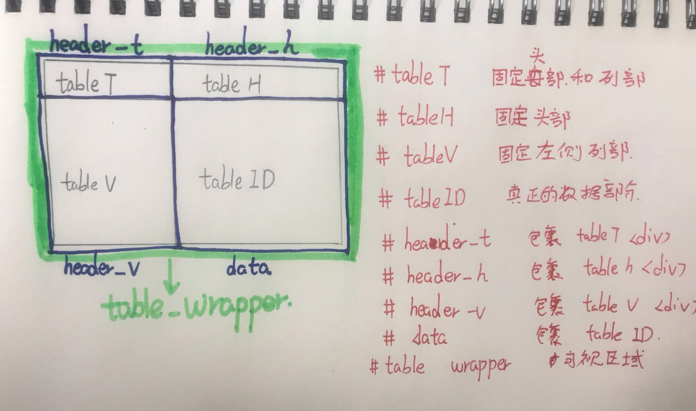

# 固定表头和左端列列表实现
 
做这个完全是因为现行的系统需要；
+ 数据太多，可读性太差， 查找页面中表格的数据项太多，查看不方便。
+ 为减少页面出现空白间隔，数据传输方式采用ajax，只需要对表格进行局部渲染。

  
## 基本结构
### 在页面中的数据显示部分
```html
    <div id="table-wrapper">
        <!--固定头部-->
        <div id="header_t">
            <table id="tableT">
                <thead>
                <!-- 初始无数据 -->
                </thead>
            </table>
        </div>
        <!--固定头部-->
        <div id="header_h">
            <table id="tableH">
                <thead>
                 <!-- 初始无数据 -->
                </thead>
            </table>
        </div>
        <!--左侧固定部-->
        <div id="header_v">
            <table id="tableV">
                <tbody>
                <!-- 初始无数据 -->
                </tbody>
            </table>
        </div>
        <!--数据部分部-->
        <div id="data">
            <table id="tabledata">
                <colgroup>
                <!-- 初始有数据 -->
                </colgroup>
                <thead>
                <!-- 初始有数据 -->
                </thead>
                <tbody>
                <!-- 初始有数据 -->
                </tbody>
            </table>
        </div>
    </div>

```

### 初始引用
基于jquery库，重要应用在选择器上，不完美，需要改进
``` html
    <!--引用了jquery的库-->
    <link rel="stylesheet" type="text/css" href="css/superTable.css">
    <script type="text/javascript" src="js/jquery.min.js"></script> 
    <script type="text/javascript" src="js/superTable.js"></script>
```

## 图示
想了半天，自己画了个图

## 思路
### 传入参数
* [ ]  **headerRows**
    需要固定的行的个数
* [ ]  **fixedCols**
    需要固定的列的个数。
* [ ]  **showWitdh**
    可视数据的宽度
* [ ]  **showHeight**
    可视数据的高度
### 思路
1. 清除以前的元素
2. 内容拷贝
3. 位置改变
4. 宽度和高度设置
5. 滚动条改变
6. margin值遮挡

## 不足
+ 只在chrome下开发，浏览器兼容性未测试
+ 目前需要点两次按钮才可以生效
+ 想把函数写成原生js
+ 写的太死了，代码太太太容易bug了。