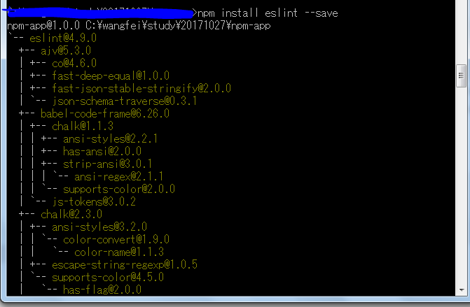
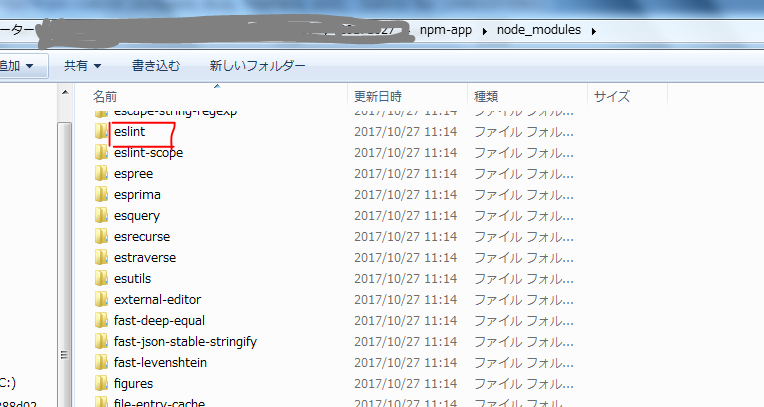

#npm 初次学习笔记
## npm 作用
对于JavaScript代码可以重复使用，，也可以方便大型项目开发。总之，就是很方便
## npm 学习途径
+ [npm官网](https://docs.npmjs.com/getting-started)  
（坚持看英语原文，不理解再查询中文）

## npm开始
### 安装node
[node官网安装](https://nodejs.org/zh-cn/)
安装完，检查一下版本信息
```
// windows 下 cmd
node -v
```

###npm 版本
+ 查看npm版本
```
npm -v
```
+ 更新npm版本
 有时候node 中npm 不是最新，npm有可能发布了新的版本，可以更新到最新版本
```shell
npm install npm@latest -g
// 然后再次查看npm版本
npm -v
```

## npm开始使用
### 建立项目文件
本次测试建立的项目文件为npm-app，在windows中
```
mkdir npm-app //创建文件
cd npm-app //进入文件
```

### 创建package.json
官网中介绍了两种方法：
1. 直接安装
2. 通过package.json安装
   选择最开始就使用packagejson,因为一来规范，而来保存配置文件，之后安装和最该都比较方便。
```json
// package.json 文件内容中，必须的两个项：name,version
{
  "name": "npm-app",
  "version": "1.0.0" // 注意这里没有逗号，要不会出错
}
```
[package.json参考资料](http://javascript.ruanyifeng.com/nodejs/packagejson.html)
[json的语法](http://www.w3school.com.cn/json/json_syntax.asp)

### 安装需要的包

```
// npm install 文件名 --save 安装需要的包，并且将目录保存下来
npm install eslint --sava

```
安装成功画面



### 查看文件变化

进入项目文件中会发现多了个**node_modules**文件下，里面有安装的包



## 下载别人的项目和上传自己的项目

上传自己的项目可以不上传**node_modules**文件下下的东西，下载后使用
```
npm install 
```
进行配置所需文件，下载别人的项目也可以使用这个方法。