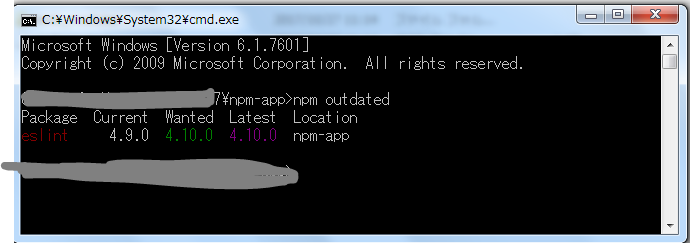
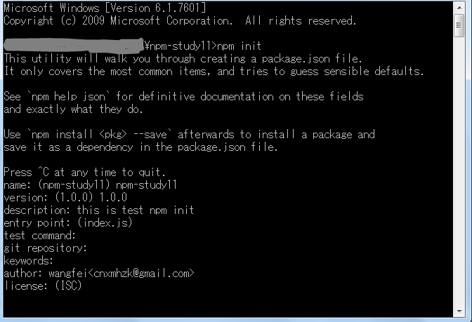
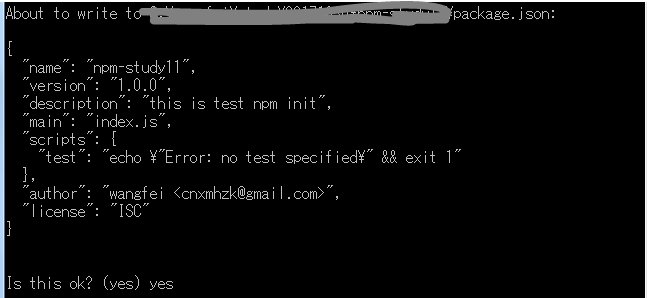
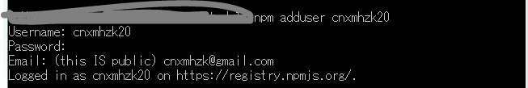
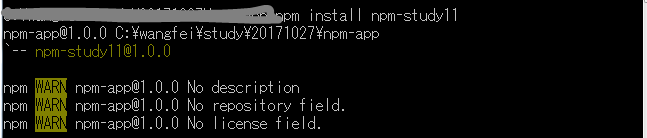

#npm 学习笔记2

+ **npm outdated**

 可以查看已经安装的包

 

+ **npm update** 

用于更新本地安装的包

+ **npm uninstall 安装包名**
 
 用于卸载某个不用的包

+ **npm uninstall --save 安装包名**

 用于卸载不用的包，并且从package.json 删除。

+ **npm install jslint -g**
 
 可以将安装包安装到全局

>本地安装
>
>1. 将安装包放在 ./node_modules 下（运行npm时所在的目录）
>2. 可以通过 require() 来引入本地安装的包

>全局安装
>
>1. 将安装包放在 /usr/local 下
>2. 可以直接在命令行里使用

###自己编辑一个新的包

**1. npm init**

可以使用npm init创建package.json。 它将提示您输入package.json字段的值。 两个必填字段是“名称”和“版本”。 您还需要为“主”设置值。 您可以使用默认的index.js。
 
会出来让你填写信息的表格
分别是package.json 中的东西，解释如下：



填入信息：
+ name （项目的名称）
+ version （版本信息）
+ description（关于项目的描述信息）
+ entry point：（入口文件）默认为index.js
+ test command：
+ git repository: （github 地址）
+ keywords: （关键词描述）
+ author：（作者）这里可以写上作者的email等信息
+ license： （许可）

出现创建成功画面：


+ 
[详细参考](https://github.com/ericdum/mujiang.info/issues/6)

**2. 编写index.js**

```js
exports.printMsg = function() {
  console.log("This is a message from the demo package");
}
```

写最简单的js，仅为测试用

**3. 添加npm 账号**

使用```npm adduser``` 添加自己的npm账号，如果没有可以去官网注册。



**4.发布自己的包**

使用```npm publish``` 对包进行发布


**5.使用**
在别的文件下使用，使用方法

```
npm install npm-study11

\\ 或者
npm install npm-study11 --save
```



**6.测试使用**

在使用的包**npm-app**的**index.js**中进行测试

```js
var demo = require("npm-study11");

demo.printMsg();
```

使用```node index.js``` 执行文件


